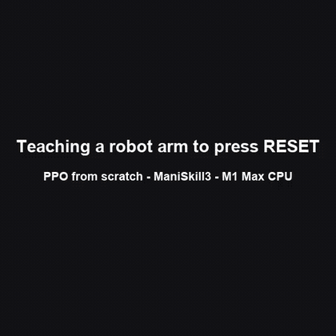
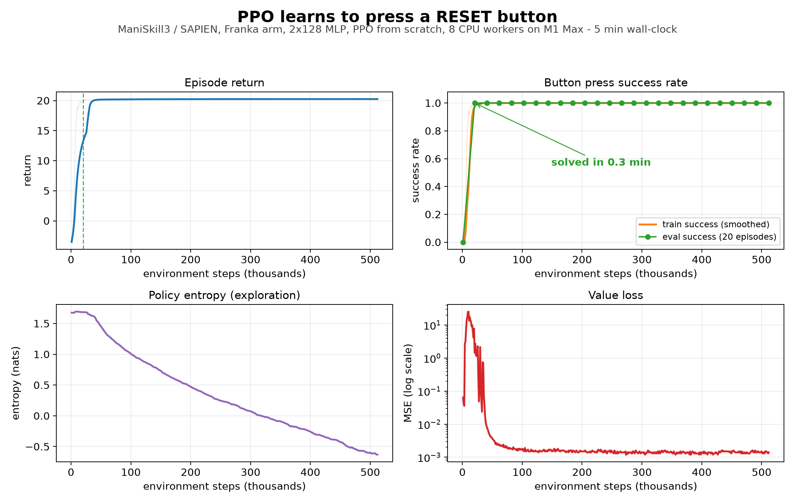
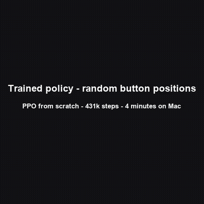

# reset-codex-button

Train a simulated Franka arm to press a big spring-loaded **RESET** button so Tibo can finally rest.

Learning project: RL from scratch — custom ManiSkill env, PPO with a small MLP, domain randomization, demo video ("Tibo has been automated").

## Results

PPO written from scratch learns to press the button in **~0.3 minutes** of training (20k steps). Early iterations flail until the 100-step timeout; the first press lands at iteration 6, and by iteration 30 the policy presses in **3 control steps**. Full 512k-step run: ~5 minutes on an M1 Max CPU, no GPU.



Full-quality video: [training progression (mp4)](media/training_progression.mp4) · [scripted oracle (mp4)](media/oracle_press.mp4)



## Stack

- [ManiSkill 3](https://maniskill.ai) / SAPIEN (CPU simulation on macOS via MoltenVK)
- PyTorch (CPU / MPS)
- Custom PPO implementation

## Setup (macOS)

```sh
brew install uv ffmpeg molten-vk
uv sync
source scripts/vulkan_env.sh
```

Reference docs: [ManiSkill macOS install](https://maniskill.readthedocs.io/en/latest/user_guide/getting_started/macos_install.html)

## Sanity checks

```sh
source scripts/vulkan_env.sh
uv run python scripts/record_demo.py -e PickCube-v1
uv run python scripts/benchmark.py -e PickCube-v1 --num-envs 1
uv run python scripts/play_env.py --steps 100 --fps 15
```

Videos land in `outputs/videos/`.

## The task: `ResetButton-v1`

A Franka arm presses a big spring-loaded button mounted on a pedestal. Defined in `reset_env/reset_button.py`.

| | |
|---|---|
| Scene | Panda + table; button on a pedestal, cap on a prismatic joint, spring drive (1000 N/m), 2 cm travel |
| Action | `pd_ee_delta_pos`, 4D `[dx, dy, dz, gripper]`, ±0.1 m per step |
| Observation | state vector (proprioception) + `tcp_to_button` (3) + `button_depression` (1) |
| Reward | `5*(prev_dist - dist)` + `2*(dep - prev_dep)` + `20` on success − `5e-4*||a||^2` |
| Success | depression ≥ 60% of travel (1.2 cm), then episode terminates |
| Episode | 100 steps at 20 Hz |

Validated with a scripted oracle (`scripts/play_env.py`): reaches the button, presses, and triggers success (+20 reward) in ~30 control steps.

Design traps encountered (worth remembering):

- The Panda's fixed-orientation Cartesian IK has a workspace floor (~z=0.074 m near the base) — the button must sit above it. Hence the pedestal.
- The cap must have clearance above the base at rest, or contact blocks it instead of the spring.
- With the cap too high, simply closing the gripper pinches the cap and "wins" without moving the arm — a reward hack.
- Spring stiffness must be strong enough to hold the cap's weight (sag ≪ travel) but weak enough for the arm to press.

## Two-button order task (`ResetButton-v6` / `v7`)

Two buttons with **randomized positions** every episode. The task: press **blue first, then red**. Red ends the episode. The reward never mentions order — it's a staged design: approach blue ×5 / red ×2 before blue is pressed; after blue, blue ×0 / red ×5 (goals shift); +20 for the first blue press; sizes penalized. Because red ends the episode, pressing red first forfeits the blue jackpot.

Ablation:
- **v6** — red-first still pays +5 (the original design), min spacing 0.15 m.
- **v7** — red-first pays 0, min spacing 0.18 m so the arm can't clip both buttons in passing.

Results after 2M steps each on the M1 Max (8 workers, ~4.6 GB RAM). Deterministic, 50 seeded episodes at ±0.3 start noise:

| | v6 | v7 |
|---|---|---|
| order success | 60% | **70%** |
| red-first | 20% | 12% |
| blue then timeout | 12% | 14% |
| mean steps (success) | — | 32.6 |

Removing the red-first payout improved order compliance; the main remaining failure mode is running out of the 200-step limit after pressing blue when buttons are far apart. Order preference emerged from reward structure alone — it was never written down.



Full-quality video: [order policy (mp4)](media/order_strict_policy.mp4) · oracle validation: `scripts/check_order_reach.py` (25/25 random layouts) · breakdown: `scripts/order_report.py`

## Training (PPO from scratch)

`train.py` + `rl/` implement PPO (clipped objective, GAE, 2x128 MLP Gaussian policy, value baseline) with 8 parallel CPU env workers over pipes, thread pinning, a RAM cap, checkpointing, and periodic evaluation.

```sh
source scripts/vulkan_env.sh
uv run python train.py --total-steps 512000 --num-workers 8 --rollout-steps 128 \
  --eval-every 20 --eval-episodes 20 \
  --snapshot-iters "1,2,3,4,5,6,8,10,15,20,30,40,60,80,120,200,300,500"

uv run python scripts/plot_learning.py --log outputs/train_log.csv
uv run python scripts/make_progression.py
uv run python scripts/eval_policy.py --checkpoint outputs/checkpoints/best.pt
```

Result on M1 Max: first successful presses appear around iteration 6 (~6k steps); eval success hits 10/10 by iteration 20 (~20k steps / 0.3 min); trained policy presses in 3 control steps. Full 512k-step run takes ~5 min wall-clock, ~4 GB RAM.

## Measured on M1 Max (32 GB, CPU sim, state obs)

| Setup | Throughput |
|---|---|
| 1 env process, no render | ~990 steps/sec |
| 8 env processes, no render | **~6,300 steps/sec aggregate** |
| sim + offscreen render (512x512) | ~166 fps |

Implication: 2M PPO steps ≈ 5 min of raw simulation, ≈ 15-30 min wall-clock with updates.

## Roadmap

1. ~~Sanity render + throughput benchmark on Mac~~
2. ~~Custom `ResetButton-v1` env (fixed button, shaped reward)~~
3. ~~PPO from scratch, 2x128 MLP~~
4. Button position randomization
5. Record early-vs-trained demo
